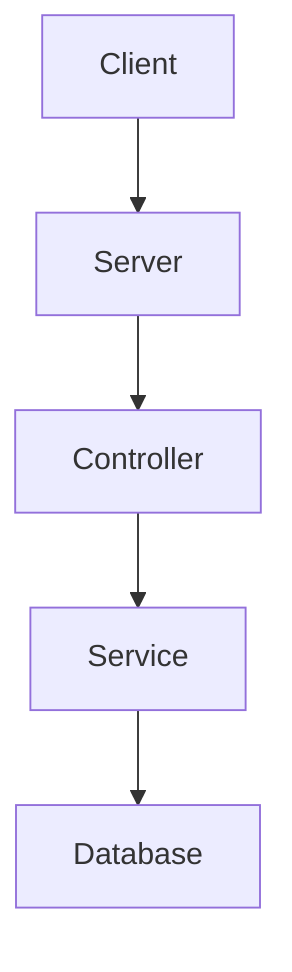
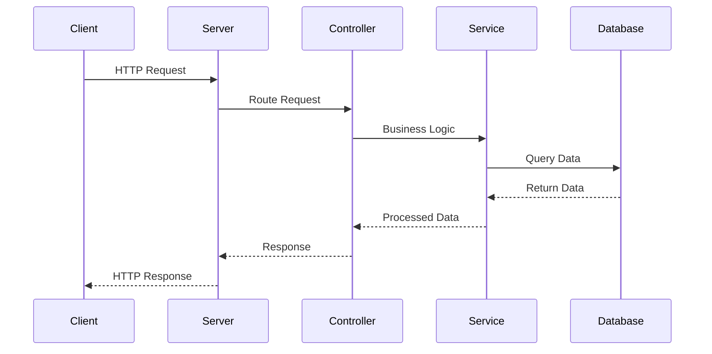

# Sample Node.js Application

This document provides an overview of a sample Node.js application, including its architecture and workflow.

## Architecture

## Workflow

## Reference Links

- [Node.js Official Website](https://nodejs.org/)
- [Express.js Documentation](https://expressjs.com/)
- [Mermaid Documentation](https://mermaid-js.github.io/mermaid/#/)
